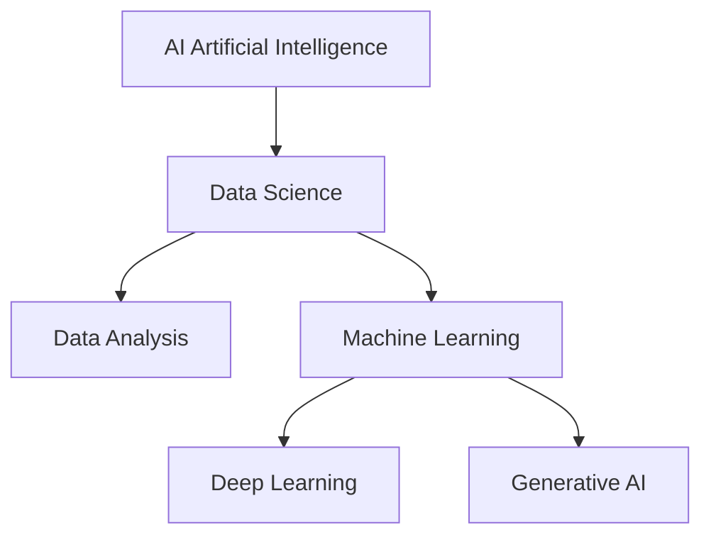

# 🤖 Data Science, Data Analysis, AI, ML, DL & Gen AI (Full Easy Lecture)

---

# 🌍 1. Artificial Intelligence (AI)

**Artificial Intelligence (AI)** is the field of making machines **think and act like humans**.

👉 Simple meaning:
**Machines that can do smart tasks**

### Examples:

* Siri / Alexa 🎤
* Self-driving cars 🚗
* Chatbots 💬

---

# 📊 2. Data Science

**Data Science** is the process of collecting, cleaning, analyzing, and using data to make decisions.

👉 Simple meaning:
**Using data to find useful information and make decisions**

---

## 📌 What Data Science Includes:

* Data Collection
* Data Cleaning
* Data Analysis
* Machine Learning

---

# 📈 3. Data Analysis

**Data Analysis** is the process of **examining data to find patterns, trends, and insights**.

👉 Simple meaning:
**Understanding data using charts and calculations**

### Example:

* Finding average marks of students
* Making bar charts of sales

---

# ⚖️ 4. Difference: Data Science vs Data Analysis

| Feature | Data Science                  | Data Analysis                |
| ------- | ----------------------------- | ---------------------------- |
| Scope   | Large (includes ML, AI, etc.) | Narrow (only analyzing data) |
| Focus   | Predictions + decisions       | Understanding data           |
| Tools   | Python, ML, AI models         | Excel, charts, graphs        |
| Output  | Predictions + insights        | Reports + summaries          |

---

# 🤖 5. Machine Learning (ML)

**Machine Learning is a part of AI where machines learn from data without being explicitly programmed.**

👉 Simple meaning:
**Computer learns from examples**

### Example:

* Spam email detection 📧
* Movie recommendations 🎬

---

## Types of ML:

* Supervised Learning
* Unsupervised Learning
* Reinforcement Learning

---

# 🧠 6. Deep Learning (DL)

**Deep Learning is a part of Machine Learning that uses neural networks like the human brain.**

👉 Simple meaning:
**Advanced ML that works like the brain**

### Examples:

* Face recognition 📱
* Voice assistants 🎤
* Self-driving cars 🚗

---

# 🎨 7. Generative AI (Gen AI)

**Generative AI is AI that can create new content like text, images, audio, and video.**

👉 Simple meaning:
**AI that creates new things**

### Examples:

* ChatGPT 💬
* AI image generators 🎨
* Music generators 🎵

---

# 🔗 8. Relationship Between All Concepts

---

# 🌍 9. Real-Life Applications

### 📚 Education

* Student performance prediction

### 🏥 Healthcare

* Disease detection

### 🛒 E-commerce

* Product recommendations

### 🚗 Transport

* Self-driving cars

### 🎨 Creative Work

* AI-generated images and text

---

# 🧠 10. Key Points

* AI = Smart machines
* Data Science = Working with data
* Data Analysis = Understanding data
* ML = Learning from data
* DL = Brain-like learning
* Gen AI = Creating new content

---

# 📌 11. Final Summary

👉 AI is the biggest field
👉 Data Science uses data for insights
👉 Data Analysis studies data
👉 ML learns from data
👉 DL learns deeper patterns
👉 Gen AI creates new content

✅ All together power modern technologies like ChatGPT, Netflix, and self-driving cars
