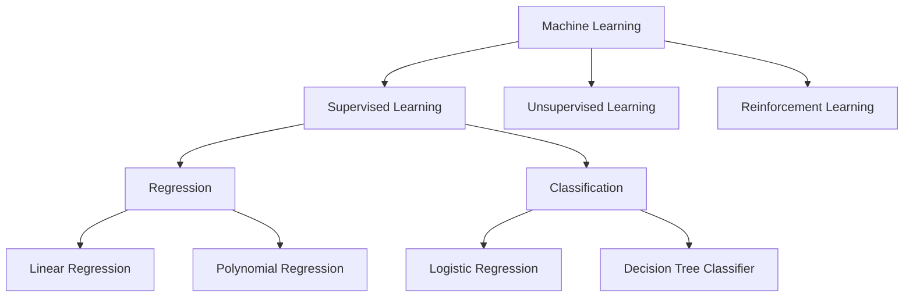

```mermaid
flowchart TD

A[Machine Learning] --> B[Supervised Learning]
A --> C[Unsupervised Learning]
A --> D[Reinforcement Learning]

B --> E[Regression]
B --> F[Classification]

E --> E1[Linear Regression]
E --> E2[Polynomial Regression]

F --> F1[Logistic Regression]
F --> F2[Decision Tree Classifier]
```
