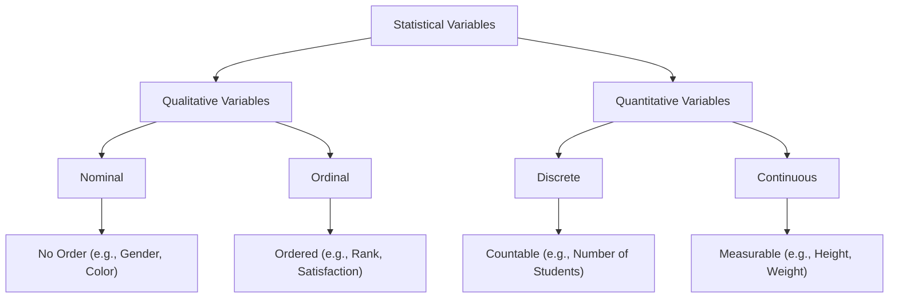

# 📊 Lecture: Statistical Variables

## 1. Introduction
In statistics, a **variable** is any characteristic, number, or quantity that can be measured or counted. Variables are essential because they represent the data we analyze.

### Examples:
- Age of students  
- Height of individuals  
- Grades in an exam  

---

## 2. Types of Statistical Variables

Statistical variables are broadly classified into **two main categories**:

### A. Qualitative Variables (Categorical)
These variables describe qualities or characteristics and are **non-numeric**.

#### 1. Nominal Variables
- No natural order  
- Categories are just labels  

**Examples:**
- Gender (Male/Female)  
- Blood Group (A, B, AB, O)  
- Colors (Red, Blue, Green)  

#### 2. Ordinal Variables
- Have a meaningful order or ranking  
- Differences between ranks may not be equal  

**Examples:**
- Rank (1st, 2nd, 3rd)  
- Satisfaction level (Low, Medium, High)  
- Education level (Primary, Secondary, Higher)  

---

### B. Quantitative Variables (Numerical)
These variables represent **numeric values** and can be measured or counted.

#### 1. Discrete Variables
- Countable values (usually integers)  
- Cannot take fractions  

**Examples:**
- Number of students in a class  
- Number of cars in a parking lot  
- Number of siblings  

#### 2. Continuous Variables
- Measurable values  
- Can take any value within a range (including decimals)  

**Examples:**
- Height (e.g., 170.5 cm)  
- Weight (e.g., 65.2 kg)  
- Temperature (e.g., 36.6°C)  

---

## 3. Key Differences

| Feature              | Qualitative Variables | Quantitative Variables |
|----------------------|---------------------|------------------------|
| Nature              | Descriptive          | Numerical              |
| Data Type           | Non-numeric          | Numeric                |
| Examples            | Gender, Color        | Height, Age            |
| Subtypes            | Nominal, Ordinal     | Discrete, Continuous   |

---

## Flowchart of Statistical Variables

## 5. Real-Life Examples

- **Qualitative (Nominal):** Favorite fruit (Apple, Mango, Banana)  
- **Qualitative (Ordinal):** Education level (Primary, Secondary, Higher)  
- **Quantitative (Discrete):** Number of books owned  
- **Quantitative (Continuous):** Body temperature  

## 7. Summary

- A **variable** is a measurable characteristic.  

- Variables are divided into:

  ### Qualitative (Categorical)
  - Nominal  
  - Ordinal  

  ### Quantitative (Numerical)
  - Discrete  
  - Continuous  
